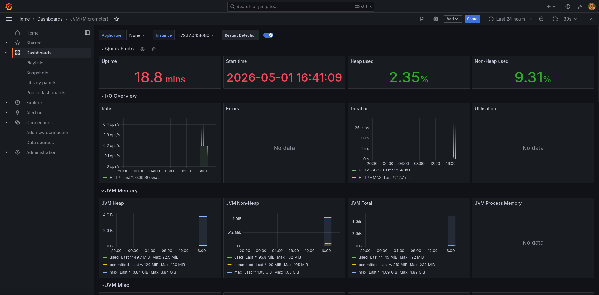
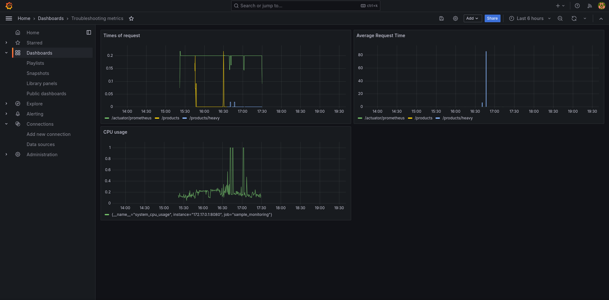

# Neoflex Homework Troubleshooting

CRUD-сервис для демонстрации мониторинга, логирования и снятия дампов потоков/памяти.
Создан в рамках домашнего задания по troubleshooting.

## Описание проекта

Spring Boot приложение с использованием H2 Database.
Реализует управление сущностью Product (название, цена, количество).
Один из методов (GET /api/products/generate-load) создаёт искусственную нагрузку на CPU.

## Стек технологий

- Java 21
- Spring Boot 4.0.6
- Spring Data JPA
- H2 Database
- Lombok
- Spring Boot Actuator
- Micrometer + Prometheus
- Grafana
- JUnit 5 + Mockito
- Maven
- Docker

## Запуск в IntelliJ IDEA

1. Склонируйте репозиторий:
   ```bash
   git clone https://github.com/Alvarans/NeoflexHomeworkTroubleshooting.git

2. Откройте проект в IntelliJ IDEA:

   File → Open → выберите папку проекта

3. Дождитесь загрузки Maven-зависимостей

4. Запустите приложение через NeoflexHomeworkTroubleshootingApplication.java

Приложение запустится на порту 8080
    Actuator: http://localhost:8080/actuator
    Prometheus metrics: http://localhost:8080/actuator/prometheus

## Запуск через Docker

1. Соберите проект:
    ```bash
    mvn clean package

2. Запустите docker-compose (приложение + Prometheus + Grafana):
    ```bash
    cd metrics
    docker compose up

3. Сервисы будут доступны:

   Приложение: http://localhost:8080
   Prometheus: http://localhost:9090
   Grafana: http://localhost:3000 (логин: admin, пароль: admin)

## API Endpoints

GET	/api/products	Получить все продукты
GET	/api/products/{id}	Получить продукт по ID
POST /api/products	Создать новый продукт
PUT	/api/products/{id}	Обновить существующий продукт
DELETE	/api/products/{id}	Удалить продукт
GET	/api/products/heavy	Создать нагрузку на CPU

## Метод генерации нагрузки

Эндпоинт GET /api/products/heavy запускает цикл из 1.000.000.000 итераций.
Используется для демонстрации снятия дампов потоков под нагрузкой.

## Логирование

В проекте использованы все 5 уровней логирования:

| Уровень | Метод                     | Сообщение                                  | Обоснование                                  |
|---------|---------------------------|--------------------------------------------|----------------------------------------------|
| TRACE   | `heavyLoad()`             | "Starting heavy load"                      | Отслеживание входа в ресурсоёмкий метод      |
| TRACE   | `heavyLoad()`             | "Exiting heavy load"                       | Отслеживание выхода из ресурсоёмкого метода  |
| DEBUG   | `create()`                | "Creating product: {}"                     | Отладка — какой продукт создаётся            |
| DEBUG   | `create()`                | "Product saved: id={}, name={}"            | Отладка — результат сохранения продукта      |
| DEBUG   | `get()`                   | "Fetching product by id {}"                | Отладка — какой ID запрашивается             |
| DEBUG   | `getAll()`                | "Fetching all products"                    | Отладка — факт вызова метода                 |
| INFO    | `create()`                | "Product created with id {}"               | Важное событие — продукт создан              |
| INFO    | `update()`                | "Updating product id {}"                   | Важное событие — продукт обновлён            |
| INFO    | `delete()`                | "Deleting product id {}"                   | Важное событие — продукт удалён              |
| INFO    | `heavyLoad()`             | "Heavy load completed"                     | Завершение ресурсоёмкой операции             |
| WARN    | `get()`                   | "Product not found: {}"                    | Продукт отсутствует — не ошибка, но важно    |
| ERROR   | `delete()`                | "Error deleting product {}"                | Критическая ошибка при удалении              |
| ERROR   | `ProjectExtentionHandler` | "Exception occurred: {}"                   | Обработка исключений — возврат 404           |

Уровень `TRACE` используется для максимально детального отслеживания входа и выхода из методов.
Уровень `DEBUG` — для отладки и диагностики при разработке (промежуточные результаты).
Уровень `INFO` — для фиксации ключевых событий жизненного цикла приложения.
Уровень `WARN` — для потенциально опасных ситуаций, которые не являются ошибками.
Уровень `ERROR` — для критических сбоев, требующих немедленного вмешательства.

## Мониторинг (Prometheus + Grafana)

### Настройка

1. Запустите docker-compose из папки `metrics`:
   ```bash
   cd metrics
   docker compose up -d
   
2. Откройте Grafana: http://localhost:3000

3. Добавьте источник данных Prometheus (URL: http://prometheus:9090)

## Дашборды

### Стандартный дашборд

Импортирован дашборд "JVM (Micrometer)" (ID: 4701) с сайта Grafana.com.
Показывает базовые метрики JVM.


### Свой дашборд

Был создан свой дашборд с 3 панелями


| Панель                      | PromQL-запрос                                                                                            | Описание                                              |
|-----------------------------|----------------------------------------------------------------------------------------------------------|-------------------------------------------------------|
| Среднее время ответа по URL | `sum by(uri)(rate(http_server_requests_seconds_sum[1m]) / rate(http_server_requests_seconds_count[1m]))` | Среднее время ответа в секундах для каждого эндпоинта |
| Количество запросов         | `sum by(uri)(rate(http_server_requests_seconds_count[1m]))`                                              | Количество запросов в секунду по каждому URL          |
| Использование CPU           | `process_cpu_usage`                                                                                      | Процент использования процессора приложением          |


## Снятие дампов

### Дамп потоков (thread dump)

Дамп потоков снят во время выполнения нагрузочного метода `GET /api/products/heavy`.

**Топ-3 потока по загрузке CPU:**

| Название потока    | Время жизни (elapsed), с | Время работы (cpu), мс | Нагрузка, % |
|--------------------|--------------------------|------------------------|-------------|
| C2 CompilerThread0 | 11995.18                 | 431337.96              | 3.596%      |
| AWT-EventQueue-0   | 11993.91                 | 336640.15              | 2.807%      |
| C1 CompilerThread0 | 11995.18                 | 117702.45              | 0.981%      |

**Формула расчёта:**  
`Процент нагрузки = (cpu_ms / (elapsed * 1000)) * 100%`

**Анализ:**
- **C2 CompilerThread0** — серверный JIT-компилятор, оптимизирует "горячий" код (нагрузка ~3.6%)
- **AWT-EventQueue-0** — поток пользовательского интерфейса IDE (~2.8%)
- **C1 CompilerThread0** — клиентский JIT-компилятор, начальная компиляция (~0.98%)

Основная нагрузка создаётся JIT-компиляцией JVM, а не самим приложением.

### Дамп памяти

Дамп памяти снят во время выполнения нагрузочного метода.

**Наибольшее потребление памяти:**

| Класс                | Количество | Размер    |
|----------------------|------------|-----------|
| `byte[]`             | 1 905 804  | 154.66 MB |
| `java.lang.String`   | 1 823 522  | 43.76 MB  |
| `java.lang.Object[]` | 595 797    | 43.59 MB  |

**Анализ:**
- `byte[]` и `String` занимают большую часть памяти — это загруженные исходные коды и индексы IDE
- `Object[]` — структуры данных для коллекций и кэшей
- Это стандартное потребление памяти для IntelliJ IDEA с открытым проектом


## GitHub Actions CI/CD

При каждом пуше в `master` автоматически запускается пайплайн, который выполняет:

1. **Сборка проекта** — `mvn clean compile`
2. **Прогон тестов** — JUnit 5 + JaCoCo (проверка покрытия кода)
3. **Отправка отчёта о покрытии** — Coveralls
4. **Сборка JAR-файла** — `mvn package -DskipTests`
5. **Создание релиза** — автоматический релиз на GitHub с прикреплённым JAR-файлом

### Статус сборки и покрытие

**Статус последнего билда**


**Покрытие кода**


